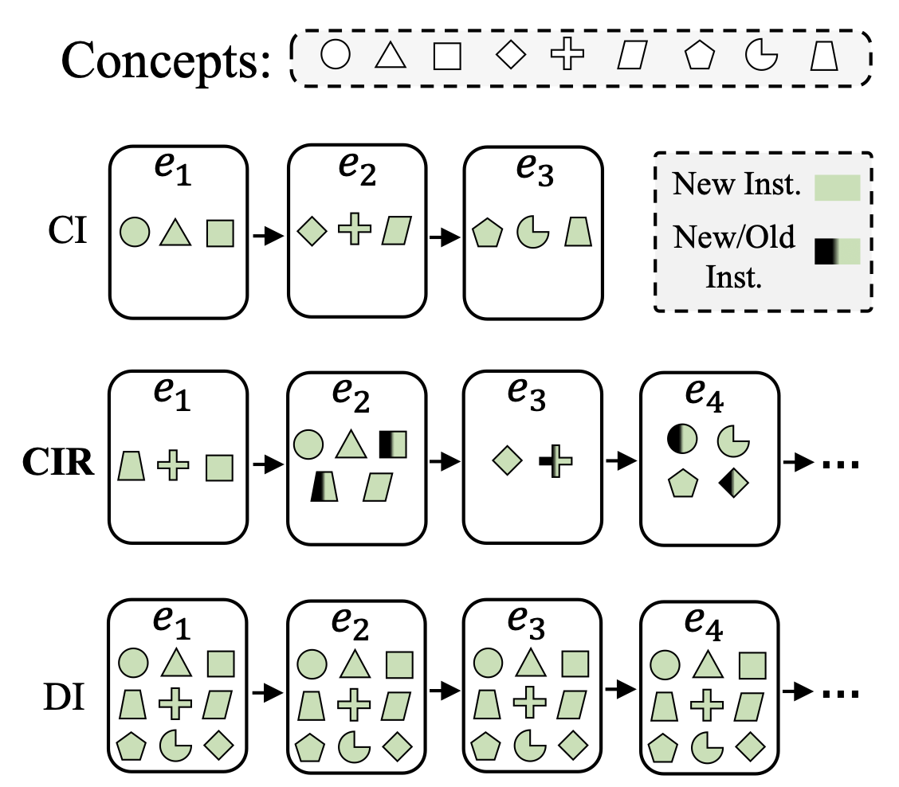

# Class-Incremental Learning with Repetition
This repository contains the official PyTorch implementation of "[Class-Incremental Learning with Reptition](https://arxiv.org/abs/2301.11396)", accepted to the Conference on Lifelong Learning Agents (CoLLAs - 2023).


<p align="center">
  
</p>

## Structure
The code structure is inspired by the [Avalanche](https://github.com/ContinualAI/avalanche) library. 

    
    ├── cir                           # CIR as a package
        ├── benchmarks
            ├── ...                   # CIR generators
        ├── metrics
            ├── ...                   # metrics used for the experiments
        ├── models
            ├── ...                   # models used for the experiments
        ├── plugins
            ├── ...                   # Avalanche-based plugins
        ├── strategies
            ├── ...                   # strategies implemented and used in the experiments
    
    ├── experiments                   # contains scripts and notebooks used for running experiments
                                      # and visualization 
        ├── configs
            ├── ...                   # default hydra configs
        ├── notebooks
            ├── ...                   # notebooks used for visualization
        ├── scripts
            ├── ...                   # scripts for reproducing results in the paper
        train_cir.py                  # main trainer script for the CIR experiments
        


## Running an experiment

This repository are based on the Avalanche library. You can first create a conda enviroment and install required packages using `environment.yml`:

1. **Install [conda](https://docs.conda.io/projects/conda/en/latest/user-guide/install/download.html)**

2. **Clone the repo** and **create the conda environment**:
```bash
git clone https://github.com/HamedHemati/CIR.git
conda env create -f environment.yml
```

Then, start an experiment using the scripts provided under `experiments/scripts`:

3. **Start training (example)**: 

```bash
python -m experiments.train_cir --multirun \
  strategy=er_rs \
  dataset=cifar-100 \
  args.generator=slot_based \
  N=10 \
  K=10,30,50,80,100 \
  memory_size=2000
```

## Generating CIR benchmarks

The notebooks `visualize_cir-slot_single_stream` and `visualize_cir_sampling_single_stream` under `experiments/notebooks` provide examples for how to generate CIR streams using both generators.
